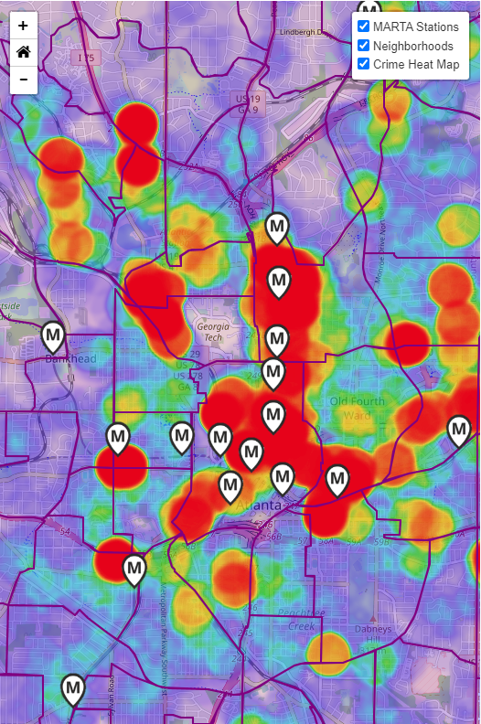
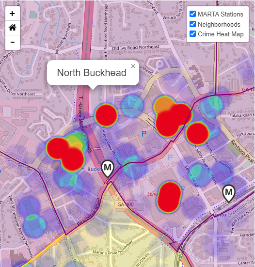

# The Secret of NIMBY
This dashboard presents an analysis of reported crimes in relation to MARTA rail stations in Atlanta, to determine if there is correlation between their locations.

## Description
NIMBY (Not In My Back Yard) is an acronym used to characterize actions of residents that oppose the placement of community infrastructure or developments preceived as unpleasant or hazardous near their home. In the context of Atlanta, GA, while residents have been lamenting the lack of public transportation, neighborhoods have been opposed to the MARTA Rail stations and lines being expanded near their homes believing crime will follow. This dashboard was built to explore any relationship between where crimes occur in Atlanta and their proximity to MARTA Rail stations. 

## Installation/Run/How to use
1. Create new database called secret_of_nimby in postgres
2. Run sql query in postgres to load table schemas
3. Save your postgres username and password in a config.py file in two locations: the root and data folders
4. Run the ETL using the etl.ipynb located in the data folder to create the datasets
5. Run the app.py file from the root folder

## Data and Delivery
Three data components were used to complete this dashboard:

| Data Description | Format | # Original Records | # Records (Post-ETL) |
|------------------|--------|--------------------|----------------------|
|[Atlanta Neighborhood Demographics (2020)][def]   | GeoJSON | 103    | 104    |
|[MARTA Transit Rail Stations][def2]               | CSV     | 38     | 38     |
|[Atlanta Police Dept Crime Database (2022)][def3] | CSV     | 21,341 | 19,939 |
|

Postgres is used to house all the data. The crime and MARTA station data is also converted to GeoJSON format for mapping. All datasets are funneled through Python Flask API routes to the dashboard. 

### Python Flask API Routes:
| API Route                      | Dashboard Element         |
|--------------------------------|---------------------------|
|@app.route('/api/neighborhoods')              |Dropdown menu     |
|@app.route('/api/crime-types')                |Dropdown menu     |
|@app.route('/api/stations.geojson')           |Map marker layer  |
|@app.route('/api/crime.geojson')              |Heat map layer    |
|@app.route('/api/neighborhood.geojson')       |Map boundary layer|
|@app.route('/api/neighborhood-info/\<nCode>') |Info box          |
|@app.route('/api/crime-type-count/\<nCode>')  |Bar chart         |
|@app.route('/api/crime-avg-distance/\<nCode>')|Radar chart       |
|

## Back End
Our dashboard contains multiple charts that reference all the crime data and is stratified by neighborhood. JavaScript libraries are used to implement a dark mode for the dashboard and a leaflet home zoom feature. Plotly is used to create the bar and radar charts.

### Languages, Tools, and Libraries
* JavaScript
* Python
* HTML
* CSS
* Jypyter Notebook
* PGAdmin/Postgres
* D3
* Bootstrap
* JQuery
* Pandas
* SQLAlchemy
* Numpy
* Datetime
* JSON
* GeoJSON
* Math
* Plotly
* Leaflet
* Leaflet Heatmap Plug-in
* Leaflet Home Zoom Plug-in
* Font-Awesome
* Dark Mode Plug-in

### Visualizations
There are four different views of data on the dashboard: 1) a neighborhood and crime infobox, 2) a map, 3) a bar chart, and 4) a radar chart. Each of these default to the City of Atlanta area on the initial page load. There are two dropdown box options that allow the user to choose a Neighborhood and Crime Type. Once an option is chosen, the charts and info box show the data for that neighborhood and the map zooms to the area. The home zoom feature resets the zoom to show all neighborhoods. The map contains a neighborhood layer, a MARTA station layer, and a crime heat layer.

![dashboard][def4]

## Conclusions
* There appears to be some correlation between the location of MARTA stations and crimes reported in Atlanta in 2022.

## Discussion
* Need to weigh an increase in crimes against a potential benefit in traffic, environmental, health, and other societal factors
* A similar analysis would need to be conducted in other cities to corroborate findings
* Other confounding factors may affect the level of crime near MARTA stations:
   * Proximity to high-traffic locations such as shopping malls. For instance, in Buckhead, we can see that crimes are densely centered at the location of shopping malls and retail districts.
   
   * Location of MARTA rail stations in urban vs rural/suburban neighborhoods
   * Level of security measures nearby MARTA rail stations in place to reduce crimes
 
### Authors
Annalyse Bergman, Lakshmi Bhimavarapu, Yi Lu, Ryan Marshall, and Meeyoung Park

[def]: https://gisdata.fultoncountyga.gov/datasets/d6298dee8938464294d3f49d473bcf15/explore?location=33.767212%2C-84.420550%2C12.00
[def2]: https://arc-garc.opendata.arcgis.com/datasets/GARC::transit-rail-stations/explore?location=33.766815%2C-84.384652%2C11.00
[def3]: https://www.atlantapd.org/home/showpublisheddocument/5257
[def4]: static/img/screen-on-load.png